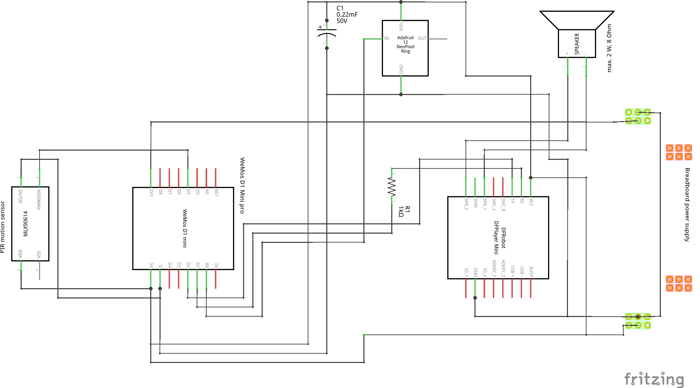

# Halloween spooky Pumpkin with ESP8266

This project is an example application for ESP8266, a Styrofoam pumpkin illuminated by Neopixel LED ring and a mp3 sound output based on DFPlayer.

An additional PIR motion sensor connected via an interrupt input recognizes movements in the environment and causes the LED light pattern to switch from a cozy fire imitation to a "spooky" blue-green as well as playing any scary sounds in mp3 format from microSD card.

The basic idea comes from the blog at AZ-Delivery: https://www.az-delivery.de/blogs/azdelivery-blog-fur-arduino-und-raspberry-pi/halloween-2019-der-kuerbis-erwacht-wieder.

## Visual impression

Here you can see the complete Halloween Pumpkin arrangement:


This is an image of the breadboard mounted on the LiPo battery pack:


I have also made a little video clip and uploaded to YT (do a CTRL+click for opneing in new tab):

<!-- [](https://youtu.be/xcfkGeqj5mk) -->
[](https://youtu.be/xcfkGeqj5mk)


## Parts list

Following parts I have used in this project:

- breadboard half+ (400 holes)
- wire jumpers
- LiPo battery pack
- USB cable with mini USB plug
- breadboard power supply (with Mini-USB-**Input**)
- Wemos D1 Mini pro (ESP8266)
- Neopixel RGB LED ring, diameter 50 mm (with 12 seperate controllable RGB LEDs by WS2812B chip)
- DFPlayer mini MP3 player module
- microSD card (16 GB)
- passive speaker (2 W, 8 Ohm)
- PIR module (motion sensor based on HC-SR501)
- resistor 1 kOhm (for protecting RxD input of DFPlayer)
- capacitor 1000 µF (protecting the Neopixel LED module)

## Breadboard layout and schematics

With *Fritzing* (https://fritzing.org) I have created following breadboard layout:


The schematics looks like this:



## Software libraries and documentation

### Neopixel RGB LED ring

Install the FastLED library: https://github.com/FastLED/FastLED.

### DFPlayer Mini

Install the DFMiniMp3 library "DFPlayer Mini Mp3 by Makuna": https://github.com/Makuna/DFMiniMp3. Documentation you will find at: https://wiki.dfrobot.com/DFPlayer_Mini_SKU_DFR0299.

### PIR module

The sensor output pin has to be connected to a interrupt capable input pin. No special library is needed. Cover the interrupt service routine (ISR) by ICACHE_RAM_ATTR to run the interrupt code in RAM, otherwise code is stored in flash and it’s slower.

```c++
void ICACHE_RAM_ATTR interrupt_pir_motion_detection() {

}
```

## SDcard: file/folder layout

The DFPlayer and the DFMiniMp3 library expects the sd card to contain these mp3 files like this folder/file scheme:

```
sd:/mp3/0001_xxx.mp3
sd:/mp3/0002_xxx.mp3
sd:/mp3/0003_xxx.mp3
```

## License

This project is licensed under the terms of "GNU General Public License v3.0". For details see [LICENSE](LICENSE).

## Todo and known issues

[issue 2019-12-07] If esp8266 cannot connect to wifi at any reason, the program stucks.


<!--  -->
